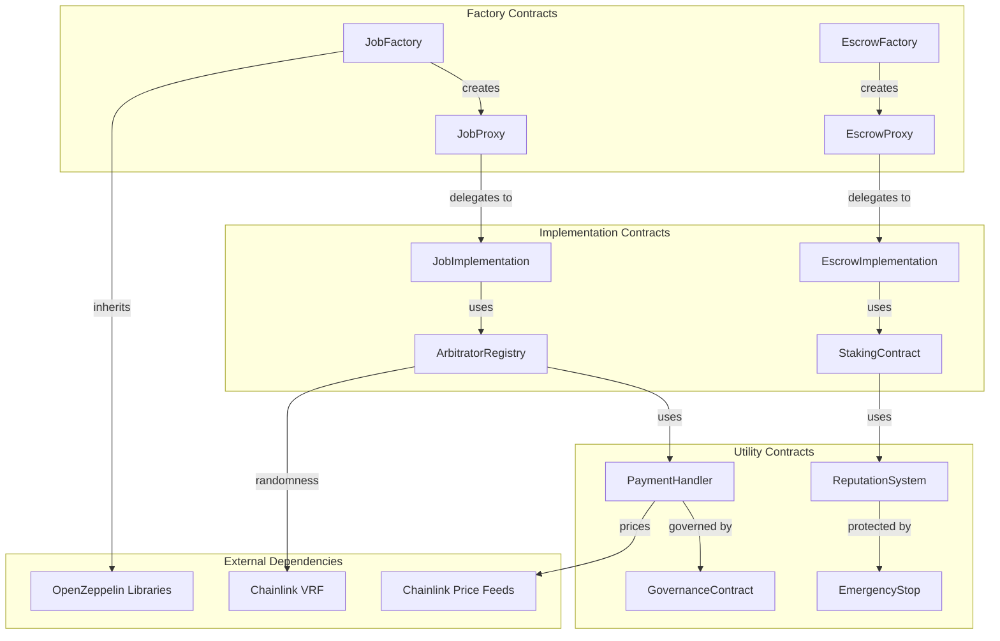

# Smart Contract Architecture

## 🏗️ Contract System Design

The platform uses a modular smart contract architecture with upgradeable proxy patterns for flexibility and security.

## 📋 Contract Hierarchy



## 🔧 Core Smart Contracts

### 1. JobFactory Contract

**Purpose**: Creates and manages individual job contracts using minimal proxy pattern

```solidity
// Key Functions
function createJob(
    string memory ipfsHash,
    uint256 totalBudget,
    address paymentToken,
    uint256[] memory milestoneAmounts,
    uint256[] memory milestoneDeadlines,
    bytes32 skillsRequired
) external returns (address jobContract);

// Events
event JobCreated(
    uint256 indexed jobId,
    address indexed client,
    address jobContract,
    string ipfsHash,
    uint256 totalBudget
);
```

**Gas Optimization**:
- Uses OpenZeppelin's Clones library for minimal proxy deployment
- Packed storage for job metadata
- Efficient event indexing

### 2. JobContract (Individual Job Instance)

**Purpose**: Manages individual job lifecycle, bids, and milestone tracking

```solidity
struct JobData {
    address client;
    string ipfsHash;
    uint256 totalBudget;
    address paymentToken;
    JobStatus status;
    uint256 createdAt;
    address selectedBidder;
    bytes32 skillsRequired;
}

struct Bid {
    address freelancer;
    uint256 proposedBudget;
    uint256 proposedTimeline;
    string proposalHash;
    uint256 submittedAt;
    BidStatus status;
}

struct Milestone {
    uint256 amount;
    uint256 deadline;
    MilestoneStatus status;
    string deliverableHash;
}
```

**Key Features**:
- Time-weighted bidding costs
- Automatic bid expiration (7 days)
- Maximum 2 bid revisions per freelancer
- Milestone-based work tracking

### 3. AdvancedEscrow Contract

**Purpose**: Secure fund management with multi-signature releases and DeFi integration

```solidity
struct EscrowAccount {
    address client;
    address freelancer;
    address arbitrator;
    address paymentToken;
    uint256 totalAmount;
    uint256 releasedAmount;
    uint256 disputedAmount;
    EscrowStatus status;
    uint256 createdAt;
    uint256[] milestoneAmounts;
    mapping(uint256 => MilestoneStatus) milestoneStatuses;
}

struct ReleaseApproval {
    mapping(address => bool) approvals;
    uint256 approvalCount;
    uint256 requiredApprovals; // 2 out of 3
}
```

**Advanced Features**:
- **DeFi Yield Integration**: Deposits idle funds in Compound/Aave
- **Payment Channels**: Off-chain micro-payments with final settlement
- **Multi-Token Support**: ETH, USDC, USDT, DAI with price oracles
- **Emergency Mechanisms**: Circuit breakers and emergency stops

### 4. ArbitratorRegistry Contract

**Purpose**: Manages arbitrator selection with geographic exclusion and reputation tracking

```solidity
struct Arbitrator {
    address arbitratorAddress;
    bytes32 locationHash;        // Hashed for privacy
    bytes32 expertiseHash;       // Skills hash
    uint256 reputation;          // 0-1000 scale
    uint256 totalCases;
    uint256 correctDecisions;
    uint256 stakedAmount;
    bool isActive;
    uint256 lastActiveTime;
}

struct ExclusionCriteria {
    bytes32 clientLocationHash;
    bytes32 freelancerLocationHash;
    bytes32 requiredExpertise;
}
```

**Selection Algorithm**:
1. Filter arbitrators by geographic exclusion
2. Match required expertise
3. Check minimum reputation threshold
4. Use Chainlink VRF for random selection
5. Assign dispute with notification

## 🔐 Security Architecture

### Access Control Matrix

| Contract | Function | Client | Freelancer | Arbitrator | Admin |
|----------|----------|--------|------------|------------|-------|
| JobFactory | createJob | ✅ | ❌ | ❌ | ✅ |
| JobContract | placeBid | ❌ | ✅ | ❌ | ❌ |
| JobContract | selectBid | ✅ | ❌ | ❌ | ❌ |
| Escrow | releasePayment | ✅ | ❌ | ✅ | ❌ |
| Escrow | raiseDispute | ✅ | ✅ | ❌ | ❌ |
| ArbitratorRegistry | makeDecision | ❌ | ❌ | ✅ | ❌ |

### Security Mechanisms

#### 1. Reentrancy Protection
```solidity
import "@openzeppelin/contracts/security/ReentrancyGuard.sol";

contract JobContract is ReentrancyGuard {
    function releasePayment(uint256 milestoneId)
        external
        nonReentrant
        onlyClient
    {
        // Protected against reentrancy attacks
    }
}
```

#### 2. Time-locks for Critical Operations
```solidity
mapping(bytes32 => uint256) public timelocks;
uint256 public constant TIMELOCK_DURATION = 24 hours;

modifier onlyAfterTimelock(bytes32 operation) {
    require(
        timelocks[operation] != 0 &&
        block.timestamp >= timelocks[operation],
        "Timelock not satisfied"
    );
    _;
}
```

#### 3. Emergency Stop Mechanism
```solidity
contract EmergencyStop {
    bool public emergencyStop = false;
    address public emergencyAdmin;

    modifier notInEmergency() {
        require(!emergencyStop, "Emergency stop activated");
        _;
    }

    function activateEmergencyStop() external {
        require(msg.sender == emergencyAdmin, "Not authorized");
        emergencyStop = true;
    }
}
```

## ⛽ Gas Optimization Strategies

### 1. Storage Optimization

#### Packed Structs
```solidity
// Bad: Uses 3 storage slots (96 bytes)
struct JobBad {
    uint256 budget;    // 32 bytes - slot 0
    address client;    // 20 bytes - slot 1 (wastes 12 bytes)
    bool isActive;     // 1 byte - slot 2 (wastes 31 bytes)
}

// Good: Uses 2 storage slots (64 bytes)
struct JobOptimized {
    uint256 budget;    // 32 bytes - slot 0
    address client;    // 20 bytes - slot 1
    bool isActive;     // 1 byte - packed with client
    uint64 deadline;   // 8 bytes - packed with client and isActive
    uint24 jobType;    // 3 bytes - still fits in slot 1
}
```

#### Bit Manipulation for Flags
```solidity
contract BitFlags {
    // Pack 8 boolean flags into 1 byte
    uint8 private flags;

    uint8 constant IS_ACTIVE = 1;       // 0001
    uint8 constant IS_FUNDED = 2;       // 0010
    uint8 constant IS_DISPUTED = 4;     // 0100
    uint8 constant IS_COMPLETED = 8;    // 1000

    function setFlag(uint8 flag) internal {
        flags |= flag;
    }

    function clearFlag(uint8 flag) internal {
        flags &= ~flag;
    }

    function hasFlag(uint8 flag) internal view returns (bool) {
        return (flags & flag) != 0;
    }
}
```

### 2. Assembly Optimization

#### Efficient Keccak256
```solidity
function efficientHash(uint256 a, uint256 b) internal pure returns (bytes32 result) {
    assembly {
        let ptr := mload(0x40)
        mstore(ptr, a)
        mstore(add(ptr, 0x20), b)
        result := keccak256(ptr, 0x40)
    }
}
```

#### Custom Errors (Solidity 0.8.4+)
```solidity
// Instead of require with string (expensive)
require(amount > 0, "Amount must be positive");

// Use custom errors (much cheaper)
error AmountTooLow(uint256 provided, uint256 minimum);

if (amount == 0) revert AmountTooLow(amount, 1);
```

### 3. Function Optimization

#### Function Selector Optimization
```solidity
// Order functions by call frequency
// Most called functions should have lower gas selector costs
function transfer(address to, uint256 amount) external {} // 0xa9059cbb - 4 bytes
function balanceOf(address account) external view {}      // 0x70a08231 - 4 bytes
```

## 📊 Event System

### Indexed Events for Efficient Querying
```solidity
event JobCreated(
    uint256 indexed jobId,        // Indexed for filtering
    address indexed client,       // Indexed for filtering
    address jobContract,          // Not indexed (data only)
    string ipfsHash,             // Not indexed (data only)
    uint256 totalBudget          // Not indexed (data only)
);

event BidSubmitted(
    uint256 indexed jobId,
    address indexed freelancer,
    uint256 indexed bidAmount,   // Indexed for range queries
    uint256 proposedTimeline
);

event MilestoneCompleted(
    bytes32 indexed escrowId,
    uint256 indexed milestoneIndex,
    uint256 amount,
    address indexed recipient
);
```

## 🔄 Upgrade Strategy

### Proxy Pattern Implementation
```solidity
// Proxy Contract (never changes)
contract JobProxy is Proxy {
    constructor(address implementation, bytes memory data) {
        _setImplementation(implementation);
        if (data.length > 0) {
            Address.functionDelegateCall(implementation, data);
        }
    }
}

// Implementation Contract (can be upgraded)
contract JobImplementationV1 is Initializable {
    function initialize(
        address client,
        string memory ipfsHash,
        uint256 totalBudget
    ) external initializer {
        // Initialization logic
    }
}

// Upgraded Implementation
contract JobImplementationV2 is JobImplementationV1 {
    // New functionality added
    function newFeature() external {
        // New feature implementation
    }
}
```

### Safe Upgrade Process
1. **Testing**: Deploy to testnet and verify functionality
2. **Audit**: Security audit of new implementation
3. **Timelock**: Use timelock for upgrade process
4. **Rollback**: Maintain ability to rollback if issues found
5. **Migration**: Migrate data if storage layout changes

## 🧪 Testing Strategy

### Unit Tests
```solidity
contract JobContractTest is Test {
    JobContract job;

    function setUp() public {
        job = new JobContract();
        job.initialize(client, "ipfs_hash", 1000 ether);
    }

    function testBidSubmission() public {
        vm.prank(freelancer);
        job.submitBid(900 ether, 30 days, "proposal_hash");

        assertEq(job.getBidCount(), 1);
    }

    function testOnlyClientCanAcceptBid() public {
        vm.prank(freelancer);
        job.submitBid(900 ether, 30 days, "proposal_hash");

        vm.prank(randomUser);
        vm.expectRevert("Only client");
        job.acceptBid(0);
    }
}
```

### Property-Based Testing
```solidity
function invariantTotalEscrowBalance() public {
    uint256 totalEscrow = escrow.getTotalBalance();
    uint256 sumIndividual = 0;

    for (uint256 i = 0; i < escrow.getEscrowCount(); i++) {
        sumIndividual += escrow.getEscrowBalance(i);
    }

    assertEq(totalEscrow, sumIndividual);
}
```

### Integration Tests
```solidity
function testCompleteJobFlow() public {
    // 1. Create job
    address jobContract = factory.createJob(ipfsHash, budget, token, milestones);

    // 2. Submit bid
    vm.prank(freelancer);
    JobContract(jobContract).submitBid(bidAmount, timeline, proposalHash);

    // 3. Accept bid
    vm.prank(client);
    JobContract(jobContract).acceptBid(0);

    // 4. Complete milestone
    vm.prank(freelancer);
    JobContract(jobContract).submitMilestone(0, deliverableHash);

    // 5. Release payment
    vm.prank(client);
    escrow.releaseMilestonePayment(escrowId, 0);

    assertEq(token.balanceOf(freelancer), bidAmount);
}
```

This smart contract architecture provides a secure, efficient, and scalable foundation for the decentralized freelancing platform.