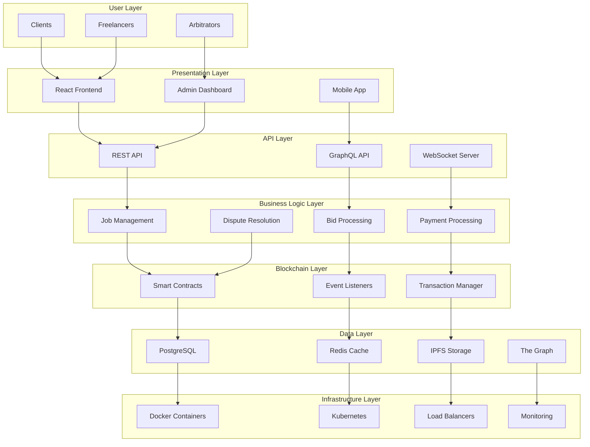
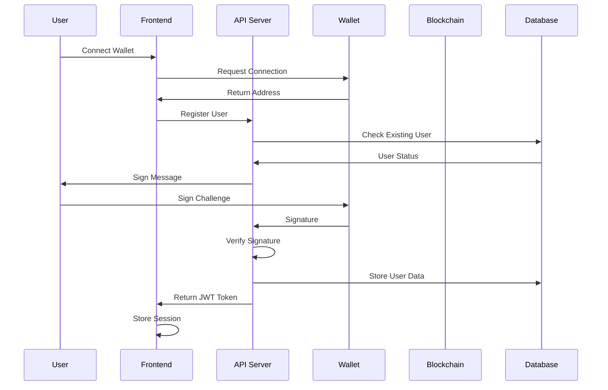
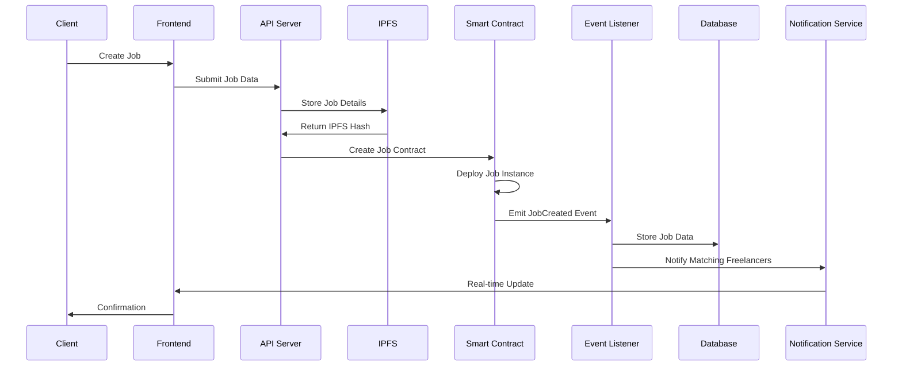
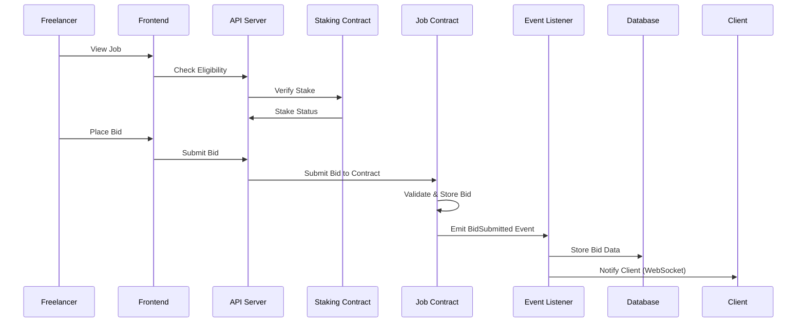
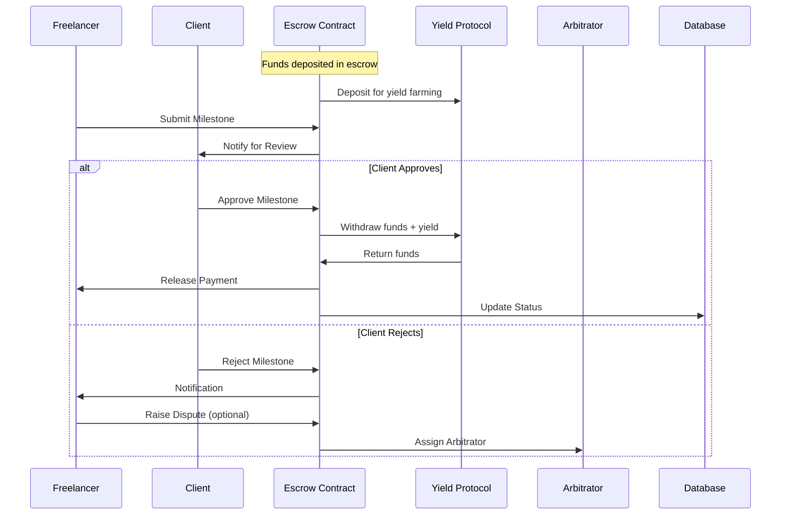
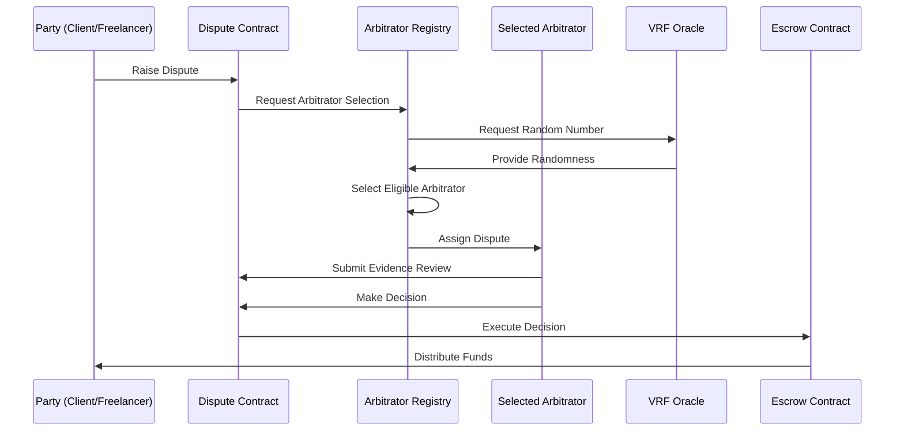
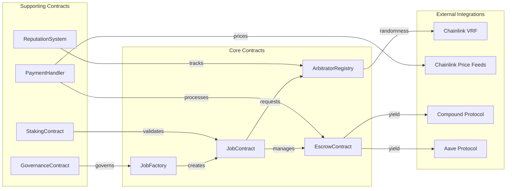
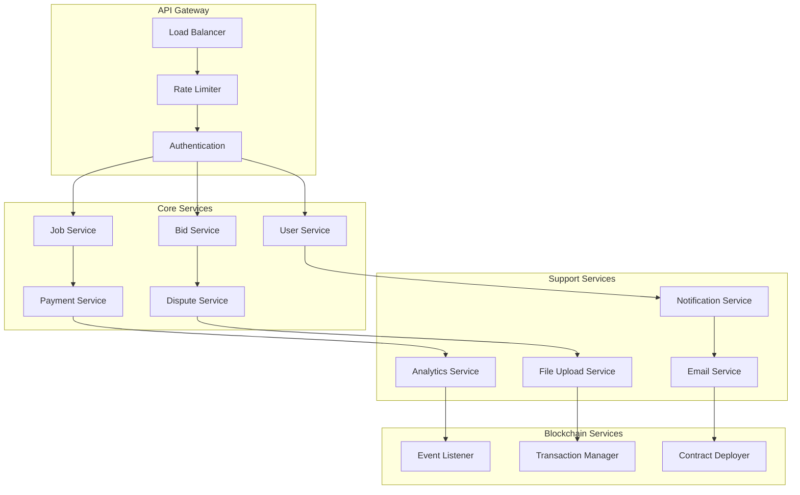
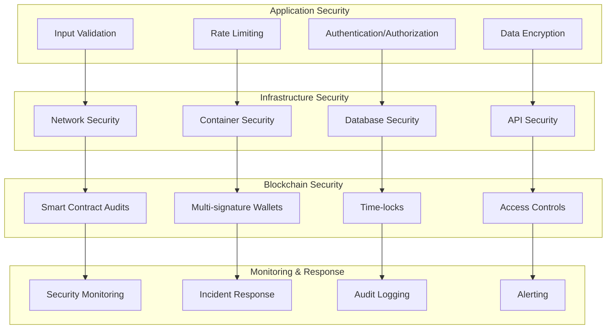
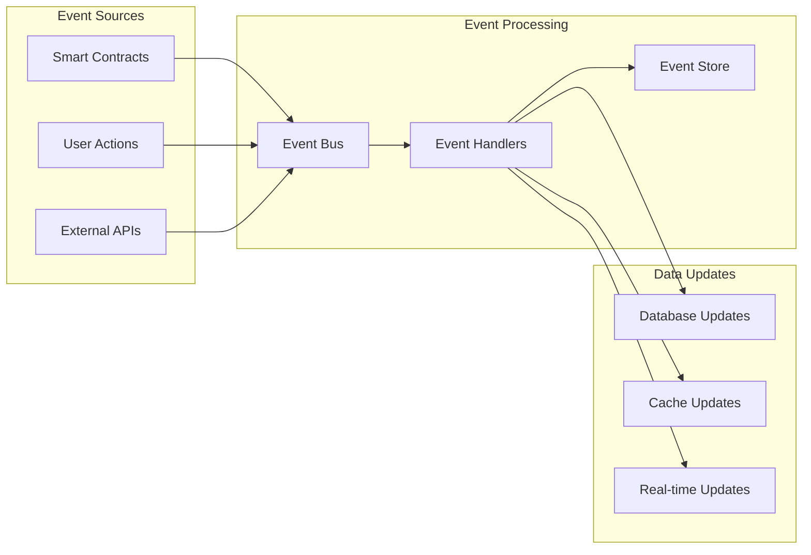

# System Architecture Overview

## 🏗️ High-Level Architecture

The Blockchain Freelancing Platform follows a decentralized architecture with multiple layers working together to provide a secure, transparent, and efficient freelancing marketplace.

## 🔄 Complete Data Flow

### 1. User Registration & Authentication

### 2. Job Posting Flow

### 3. Bidding Process

### 4. Milestone & Payment Flow

### 5. Dispute Resolution Flow

## 🧩 Component Interactions

### Smart Contract Ecosystem

### Backend Service Architecture

## 🔒 Security Architecture

### Multi-Layer Security Model

## 📊 Performance Considerations

### Scalability Strategy

1. **Horizontal Scaling**
   - Microservices architecture
   - Container orchestration with Kubernetes
   - Load balancing across multiple instances

2. **Database Optimization**
   - Read replicas for query scaling
   - Connection pooling
   - Query optimization and indexing
   - Caching layer with Redis

3. **Blockchain Scaling**
   - Layer 2 solutions (Polygon, Arbitrum)
   - State channels for frequent interactions
   - Batch processing for multiple operations

4. **Frontend Optimization**
   - Code splitting and lazy loading
   - CDN for static assets
   - Service workers for offline capability
   - Progressive Web App features

### Performance Metrics

- **API Response Time**: < 200ms for 95% of requests
- **Blockchain Transaction Time**: < 3 seconds with Layer 2
- **Database Query Time**: < 50ms for complex queries
- **Frontend Load Time**: < 2 seconds initial load
- **WebSocket Latency**: < 100ms for real-time updates

## 🔄 Data Consistency Model

### Event-Driven Architecture

### Eventual Consistency Handling

1. **Blockchain Events**: Process with retry logic and dead letter queues
2. **Database Transactions**: Use ACID properties for critical operations
3. **Cache Invalidation**: Implement cache-aside pattern with TTL
4. **Conflict Resolution**: Implement last-writer-wins with timestamps

This architecture ensures high availability, scalability, and security while maintaining the decentralized nature of the platform.